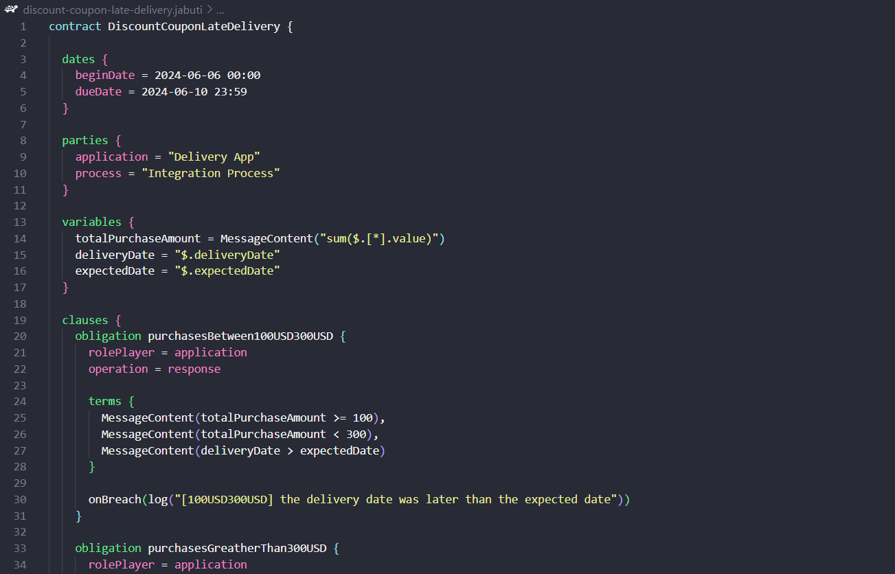
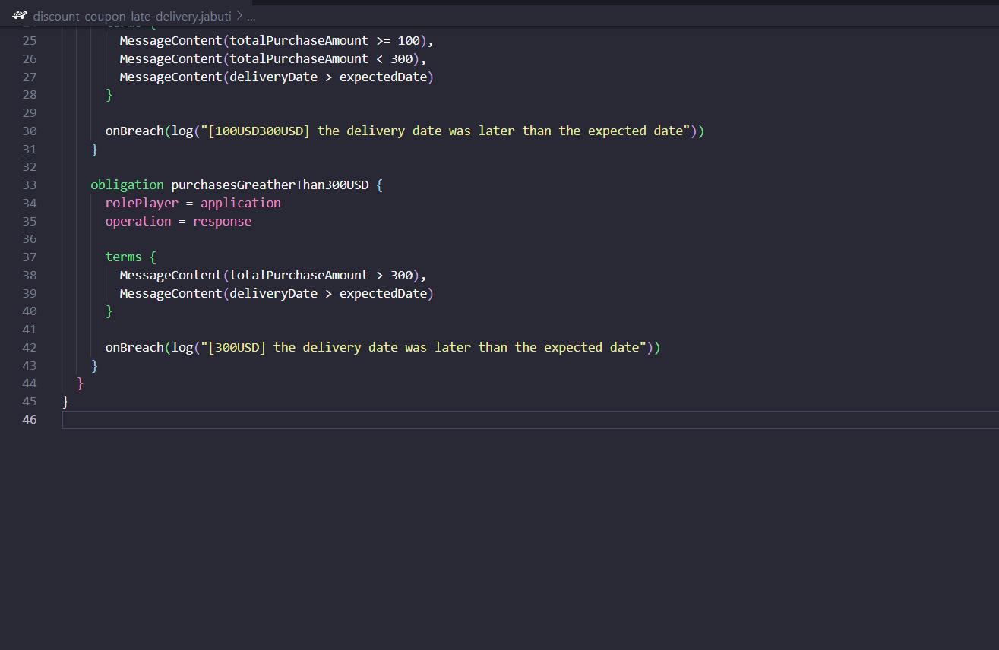
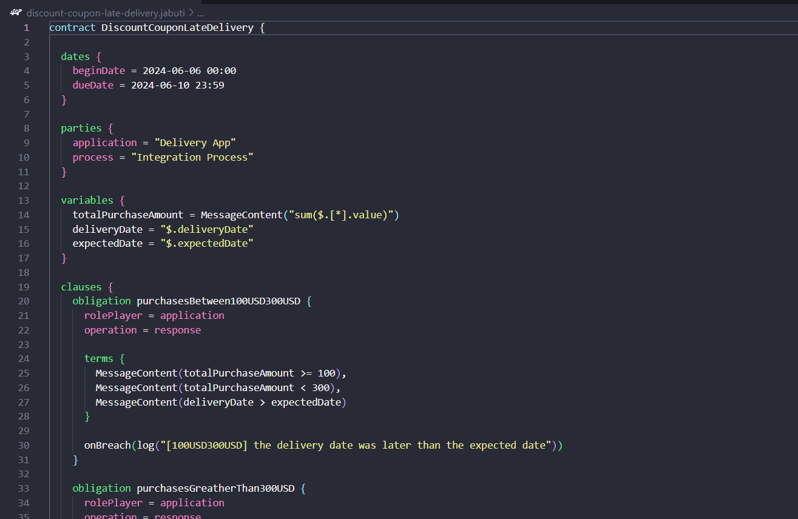
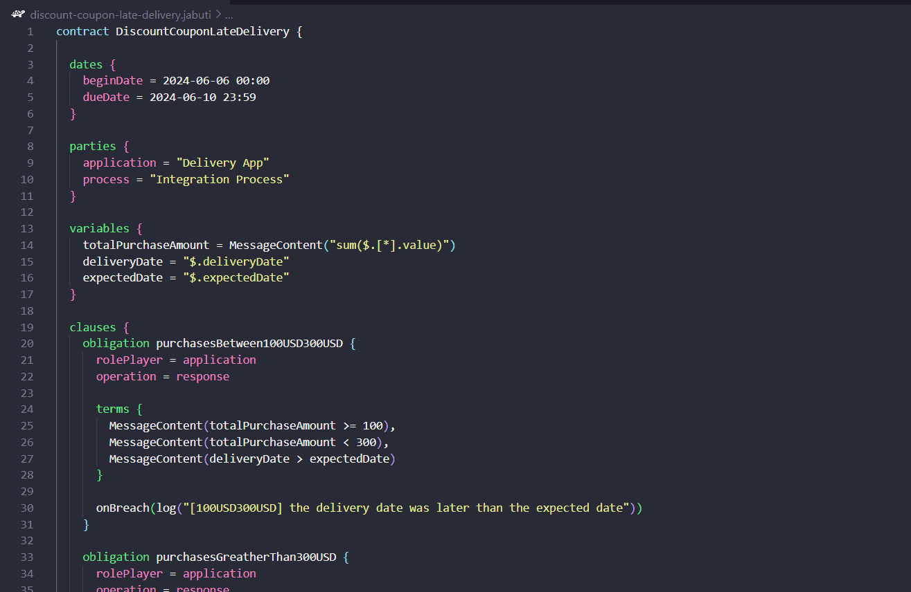
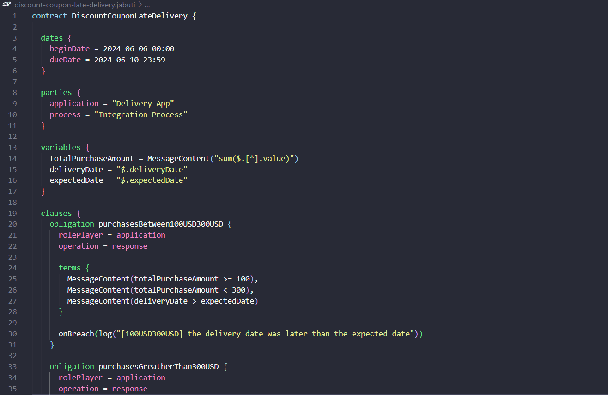
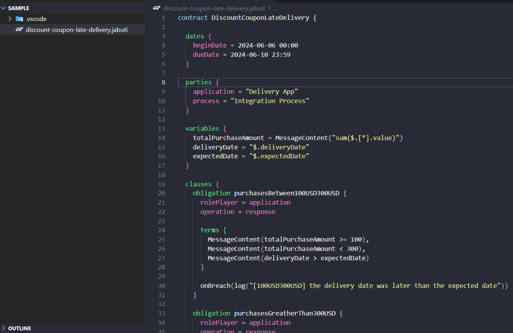

<h1 align="center">
   
  
  
   
  Jabuti CE
   
</h1>

<h4 align="center">A Visual Studio Code extension for Jabuti DSL.</h4>

 

Jabuti CE is an extension for VSCode that provides support for editing Jabuti DSL smart contracts.

Main features:
- Code highlighting
- Autocompletition
- Code navigation
- Syntax and semantic validation
- Documentation on hover
- Code transformation

## Jabuti project papers
- [Advances in a DSL to Specify Smart Contracts for Application Integration Processes](https://sol.sbc.org.br/index.php/cibse/article/view/20962)
- [On the Need to Use Smart Contracts in Enterprise Application Integration](https://idus.us.es/handle/11441/140199)
- [Jabuti CE: A Tool for Specifying Smart Contracts in the Domain of Enterprise Application Integration](https://www.scitepress.org/Link.aspx?doi=10.5220/0012413300003645)

## Jabuti projetct repositories
- VSCode based projects
  - [Jabuti DSL Grammar](https://github.com/gca-research-group/jabuti-ce-jabuti-dsl-grammar)
  - [Transformation Engine](https://github.com/gca-research-group/jabuti-ce-transformation-engine)
  - [VSCode Plugin](https://github.com/gca-research-group/jabuti-ce-vscode-plugin)
- XText based project
  - [XText/Xtend implementation](https://github.com/gca-research-group/dsl-smart-contract-eai)

## Features

### Code highlighting

### Autocompletition

### Code navigation

### Syntax and semantic validation

### Documentation on hover

### Code transformation

## License

Copyright © 2023 [The Applied Computing Research Group (GCA)](https://github.com/gca-research-group). 
This project is [MIT](https://github.com/gca-research-group/jabuti-dsl-language-antlr/blob/master/LICENSE) licensed.
